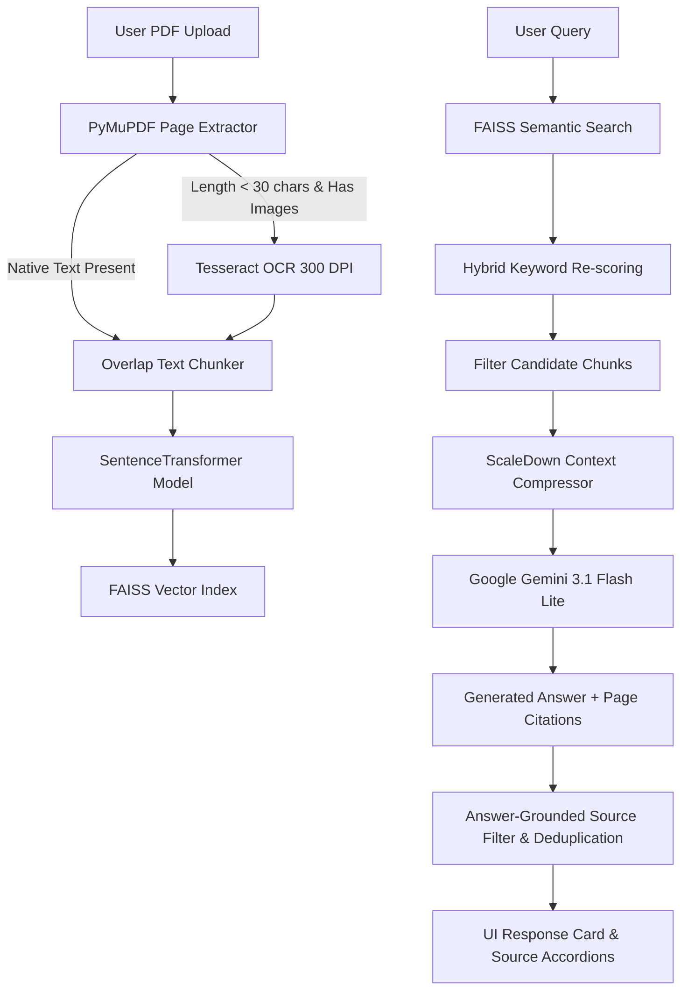

# Product Manual Assistant

[](https://www.python.org/)
[](https://fastapi.tiangolo.com/)
[](https://react.dev/)
[](https://vitejs.dev/)
[](https://tailwindcss.com/)
[](https://ai.google.dev/)
[](https://github.com/facebookresearch/faiss)
[](https://supabase.com/)

**Product Manual Assistant** is an end-to-end, multi-document RAG (Retrieval-Augmented Generation) application that turns complex product user manuals into searchable, interactive conversational workspaces. Users can upload text or scanned PDF manuals, ask plain-language questions, and receive concise, grounded answers accompanied by verified page-level source citations.

---

## Overview

### The Problem
Consumer electronics, appliances, and industrial equipment come with long, dense PDF user manuals (30–100+ pages). Finding quick solutions for troubleshooting, initial setup, or temperature settings using generic PDF search is tedious:
- Keyword searches return dozens of irrelevant occurrences.
- Scanned diagram pages lack searchable text.
- Traditional LLM chatbots hallucinate answers when not properly grounded in manual text.
- Standard RAG systems often return clutter by displaying weak or unrelated retrieved source cards.

### The Solution
Product Manual Assistant solves these challenges through a specialized pipeline:
1. **Smart Text Extraction & Selective OCR**: Extracts native PDF text and automatically falls back to Tesseract OCR at 300 DPI only on sparse image pages.
2. **Dense Vector Search & Hybrid Reranking**: Combines SentenceTransformer embeddings (`all-MiniLM-L6-v2`), FAISS vector similarity, and keyword lexical re-ranking.
3. **ScaleDown Context Compression**: Reduces prompt token overhead while preserving exact sentence context before calling LLMs.
4. **Grounded Generation & Source Synchronization**: Google Gemini generates strict, manual-grounded answers with explicit `[Page N]` citations. User-facing source cards are filtered and deduplicated 1:1 with cited pages.

---

## Key Features

- **Multi-Document Workspace**: Upload, index, and organize multiple PDF product manuals per session or user account.
- **Smart OCR Processing**: PyMuPDF handles native text extraction; Tesseract OCR automatically processes scanned image pages without wasting time on empty or vector-only pages.
- **Hybrid Retrieval Pipeline**: Dense semantic vector retrieval using FAISS `IndexFlatIP` paired with exact-keyword lexical re-scoring.
- **ScaleDown Context Compression**: Sentences are compressed and ranked against the user query, saving token count while preserving technical accuracy.
- **Strictly Grounded Answer Generation**: Google Gemini 3.1 Flash Lite writes accurate answers using only retrieved manual excerpts, avoiding outside hallucination.
- **Automatic Language & Script Detection**: Supports queries in English, Devanagari Hindi, Spanish, and natural Hinglish (Romanized Hindi) with automatic tone matching.
- **Answer-Grounded Source Sync**: Only sources explicitly cited in the generated answer appear as UI cards. Card count and header counts are synchronized 1:1.
- **Dual-Mode Persistence & Auth**:
  - **Authenticated Mode**: Supabase JWT authentication, PostgreSQL chat history, document metadata, and Supabase Storage bucket persistence.
  - **Guest Mode**: Local SQLite database, local file storage fallback, and seamless session isolation.

---

## How It Works



### Execution Steps
1. **Ingestion & Extraction**: PyMuPDF parses the PDF page-by-page. If a page has fewer than 30 characters and contains raster images, Tesseract OCR executes at 300 DPI.
2. **Chunking & Indexing**: Pages are chunked (500 chars with 50-char overlap) preserving original page numbers. Embeddings are calculated using `all-MiniLM-L6-v2` and stored in a FAISS index.
3. **Hybrid Retrieval**: Candidate passages (top $k=5$) are retrieved using cosine inner product similarity and re-scored using lexical keyword match density.
4. **Compression & Grounding**: Passages meeting the minimum retrieval score threshold (`0.20`) are compressed via `ScaleDown` and sent to Google Gemini with strict grounding instructions.
5. **Citations & UI Synchronization**: The answer is parsed for explicit `[Page N]` citations. The frontend renders the answer markdown along with deduplicated, answer-grounded source cards matching the exact count.

---

## Tech Stack

| Category | Technology | Usage |
| :--- | :--- | :--- |
| **Frontend** | React 18, Vite 6, TypeScript | Interactive SPA UI, state management, Markdown rendering |
| **Styling** | Tailwind CSS, Lucide React | Modern glassmorphism design system, responsive layouts |
| **Backend API** | Python 3.10+, FastAPI, Uvicorn | Async REST API endpoints, ownership checks, payload validation |
| **AI / RAG** | Google Gemini API (`google-genai`), FAISS | Grounded LLM generation, dense vector search |
| **Embeddings** | SentenceTransformers (`all-MiniLM-L6-v2`) | 384-dimensional dense text vector embeddings |
| **PDF & OCR** | PyMuPDF (fitz), Tesseract OCR | Native PDF text parsing, 300 DPI OCR image processing |
| **Database & Auth** | Supabase (PostgreSQL, Auth, Storage) | User profiles, persistent chat history, document storage |
| **Local Fallback** | SQLite 3, Local File Storage | Offline guest mode storage for document chunks and FAISS indexes |
| **Testing** | Python `unittest` | Automated unit test suite for auth, chunking, and RAG logic |

---

## Project Structure

```text
product-manual-assistant/
├── backend/
│   ├── api/
│   │   ├── auth.py              # Supabase JWT authentication & guest session handlers
│   │   └── main.py              # FastAPI router, CORS, RAG query endpoints
│   ├── data/                    # Local storage fallback directory (auto-created)
│   │   ├── app.db               # SQLite local database
│   │   ├── indexes/             # Local FAISS index & metadata files (.faiss, .pkl)
│   │   └── manuals/             # Local PDF uploads (.pdf)
│   ├── rag/
│   │   ├── chunker.py           # Text chunking with page metadata tracking
│   │   ├── generator.py         # Gemini API client, language detection, prompt rules
│   │   ├── pdf_loader.py        # PyMuPDF parser + smart Tesseract OCR fallback
│   │   └── retriever.py        # FAISS vector retriever & hybrid keyword reranker
│   ├── scaledown/
│   │   └── compressor.py        # Question-aware lexical context compression
│   ├── database.py              # Dual-mode persistence layer (Supabase + SQLite)
│   └── database_schema.sql      # Supabase PostgreSQL schema & RLS policies
├── frontend/
│   ├── src/
│   │   ├── components/          # React UI components (AnswerCard, Sidebar, AuthModal, etc.)
│   │   ├── lib/                 # Supabase client & utility functions
│   │   ├── App.tsx              # Main application container & workspace state
│   │   ├── main.tsx             # React DOM root entry point
│   │   ├── style.css            # Tailwind CSS custom design system
│   │   └── types.ts             # TypeScript interfaces for API models
│   ├── index.html               # SPA HTML template
│   ├── package.json             # Frontend npm dependencies
│   ├── tailwind.config.js       # Tailwind CSS styling configuration
│   └── vite.config.ts           # Vite build & proxy settings
├── tests/
│   ├── test_auth.py             # Unit tests for JWT validation & guest fallback
│   └── test_rag_core.py         # Unit tests for chunker, compression, OCR & filtering
├── .env.example                 # Environment variable configuration template
├── .gitignore                   # Workspace git exclusion rules
├── README.md                    # Project documentation
└── requirements.txt             # Python backend dependencies
```

---

## Architecture & Security

### Dual-Mode Data Architecture
- **Cloud Mode**: When `SUPABASE_URL` and `SUPABASE_SERVICE_ROLE_KEY` are provided, documents, chunk records, and chat conversations persist to Supabase PostgreSQL. Uploaded PDFs are stored securely in the Supabase Storage `manuals` bucket.
- **Local Fallback Mode**: When running without cloud credentials or during guest sessions, data persists locally to SQLite (`backend/data/app.db`) and local disk storage (`backend/data/indexes/` and `backend/data/manuals/`).

### Authentication & RLS Security
- **JWT Verification**: The FastAPI backend validates Supabase JWT tokens (`HS256` or `ES256` algorithms via JWKS).
- **Row Level Security**: Database queries strictly filter records by `user_id`, ensuring user workspace isolation.

---

## Environment Variables

Create a `.env` file in the root directory based on `.env.example`:

```env
# Gemini RAG Configuration
GEMINI_API_KEY=your_gemini_api_key_here
GEMINI_MODEL=gemini-3.1-flash-lite

# Supabase Frontend Configuration
VITE_SUPABASE_URL=https://your-supabase-project.supabase.co
VITE_SUPABASE_ANON_KEY=your_supabase_anon_key_here

# Supabase Backend Configuration
SUPABASE_URL=https://your-supabase-project.supabase.co
SUPABASE_JWT_SECRET=your_supabase_jwt_secret_here
SUPABASE_SERVICE_ROLE_KEY=your_supabase_service_role_key_here
```

---

## Local Setup & Development

### Prerequisites
- **Python**: 3.10 or higher
- **Node.js**: v18 or higher & npm
- **Tesseract OCR**: Installed at `C:\Program Files\Tesseract-OCR` (Windows) or available in system PATH (Linux/macOS) for scanned PDF support.

### 1. Clone Repository & Setup Virtual Environment

```bash
git clone https://github.com/your-username/product-manual-assistant.git
cd product-manual-assistant

# Create and activate Python virtual environment
python -m venv .venv

# On Windows (PowerShell):
.venv\Scripts\Activate.ps1
# On Linux/macOS:
source .venv/bin/activate
```

### 2. Install Dependencies

```bash
# Install backend Python dependencies
pip install -r requirements.txt

# Install frontend npm dependencies
cd frontend
npm install
cd ..
```

### 3. Configure Environment Variables

```bash
cp .env.example .env
# Edit .env and supply your GEMINI_API_KEY (and optional Supabase credentials)
```

### 4. Run Development Servers

**Backend (FastAPI)**:
```bash
# From workspace root:
python -m uvicorn backend.api.main:app --reload --port 8000
```
*API will run at `http://localhost:8000` (Swagger docs at `http://localhost:8000/docs`).*

**Frontend (Vite)**:
```bash
# In a separate terminal tab:
cd frontend
npm run dev
```
*Frontend app will run at `http://localhost:5173`.*

---

## Testing

The project includes an automated backend test suite covering JWT authentication, RAG chunking, language detection, ScaleDown compression, PDF OCR fallback, and source relevance filtering.

To run all backend unit tests:

```bash
python -m unittest discover -s tests
```

To run frontend TypeScript and production build checks:

```bash
cd frontend
npm run build
```

---

## Deployment Guidance

### Intended Architecture
- **Frontend**: Deploy static Vite build (`frontend/dist/`) to **Vercel**, **Netlify**, or **Cloudflare Pages**. Set `VITE_SUPABASE_URL` and `VITE_SUPABASE_ANON_KEY` in environment settings.
- **Backend**: Deploy FastAPI backend to **Render**, **Railway**, or **Google Cloud Run**. Ensure `Tesseract-OCR` is installed in the container image if scanned PDF OCR is required.
- **Database**: Configure Supabase PostgreSQL database by executing `backend/database_schema.sql` in the Supabase SQL Editor.

---

## Limitations

- **File Size**: Maximum upload size is currently set to 20 MB per PDF manual.
- **Encrypted PDFs**: Password-protected or encrypted PDFs must be decrypted before uploading.
- **System Dependencies**: OCR for scanned PDFs requires Tesseract OCR installed on the host OS.

---

## Future Improvements

- [ ] Support for tabular data extraction from complex specification tables.
- [ ] Multi-manual cross-document search within custom collection folders.
- [ ] Voice query input and audio answer synthesis.

---

## Author

**Dev Verma**  
*Full-Stack & AI Systems Engineer*
