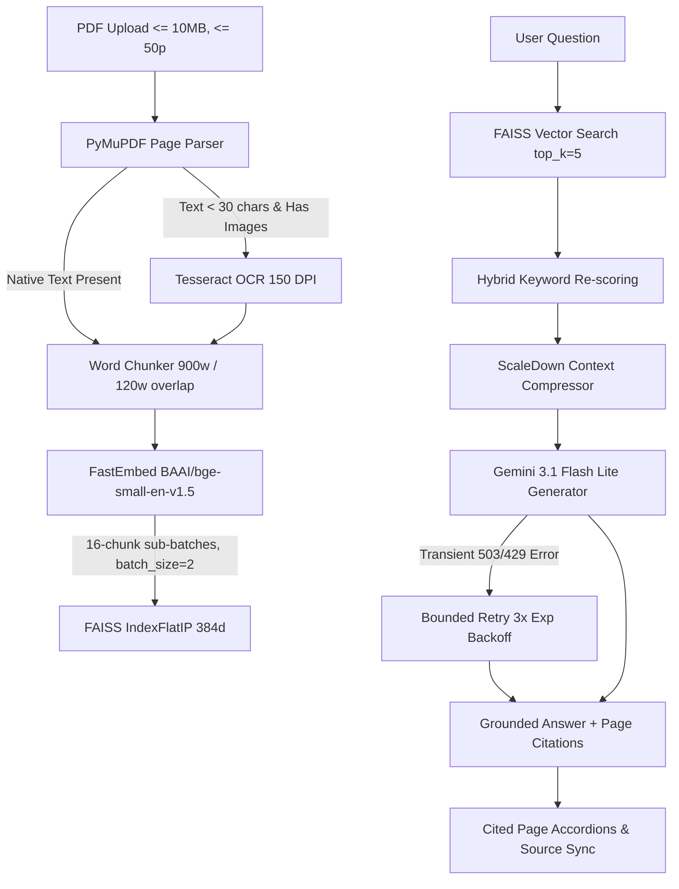

# Product Manual Assistant

[](https://www.python.org/)
[](https://fastapi.tiangolo.com/)
[](https://react.dev/)
[](https://www.typescriptlang.org/)
[](https://vitejs.dev/)
[](https://tailwindcss.com/)
[](https://ai.google.dev/)
[](https://github.com/qdrant/fastembed)
[](https://github.com/facebookresearch/faiss)
[](https://supabase.com/)

Product Manual Assistant is a multi-document Retrieval-Augmented Generation (RAG) application that turns complex PDF product user manuals into searchable, conversational workspaces. Users can upload manuals, ask questions in natural language, and receive grounded answers with page-level citations.

🚀 **Live Demo:** [https://manualassistant.vercel.app](https://manualassistant.vercel.app)

---

## Overview

### Problem
Consumer electronics, appliances, and machinery come with long, technical PDF manuals (30–50+ pages). Locating specific setup, maintenance, or troubleshooting steps using standard PDF search is slow and imprecise. Direct queries to general-purpose LLMs can lead to inaccurate or ungrounded responses when document context is missing.

### Solution
Product Manual Assistant uses a dedicated pipeline to process PDF documents and deliver grounded responses:
- **Text Extraction & OCR**: Extracts native PDF text page-by-page, using Tesseract OCR fallback at 150 DPI for image-heavy or scanned pages.
- **Vector Indexing**: Computes 384-dimensional embeddings (`BAAI/bge-small-en-v1.5`) via FastEmbed and indexes passages using FAISS (`IndexFlatIP`).
- **Hybrid Search & Compression**: Combines vector similarity with keyword re-scoring and ScaleDown context compression before sending prompts to the LLM.
- **Grounded Generation**: Uses Google Gemini (`gemini-3.1-flash-lite`) to produce answers constrained to retrieved manual excerpts with explicit page citations.

---

## Key Features

- **Multi-Document Workspace**: Upload, index, and organize multiple PDF product manuals per session or user account.
- **Smart PDF Extraction & OCR**: PyMuPDF handles text parsing, with Tesseract OCR fallback at 150 DPI triggered on image-heavy pages (<30 characters of text).
- **Memory-Optimized Vector Pipeline**: FastEmbed ONNX inference (`batch_size=2`) and incremental FAISS index population (16-chunk sub-batches) designed for 512 MB RAM environments.
- **Hybrid Retrieval & Context Compression**: Vector similarity paired with lexical re-ranking and ScaleDown compression (target ratio 0.90) to optimize token usage.
- **Gemini API Integration with Bounded Retries**: Grounded answer generation using `gemini-3.1-flash-lite` with exponential backoff (up to 3 retries at 2s, 4s, 8s) for transient 503/429 errors.
- **Page Citation Mapping**: Answers include explicit `[Page N]` citations mapped directly to expandable source accordions in the UI.
- **Dual-Mode Data Architecture**:
  - **Cloud Mode**: Supabase Auth (Email/Password, OTP, Google OAuth), PostgreSQL database with Row-Level Security (RLS), and Supabase Storage.
  - **Guest Mode**: Local SQLite database (`backend/data/app.db`), local FAISS indexes (`backend/data/indexes/`), and local PDF storage.
- **Responsive Web UI**: SPA interface built with React, TypeScript, and Tailwind CSS, responsive across mobile (320px+) and desktop displays.

---

## How It Works



### Execution Pipeline
1. **Validation & Extraction**: Validates file size ($\le 10\text{ MB}$), page count ($\le 50\text{ pages}$), and encryption status. PyMuPDF extracts native page text, triggering Tesseract OCR at 150 DPI on scanned image pages.
2. **Chunking**: Splits pages into overlapping text chunks (`900` words per chunk, `120` word overlap), filtering out Table of Contents sections.
3. **Vector Indexing**: FastEmbed (`BAAI/bge-small-en-v1.5`) calculates 384-dimensional embeddings, inserting them into FAISS (`IndexFlatIP`) in 16-chunk sub-batches with $L_2$ normalization.
4. **Retrieval & Compression**: Retrieves top candidate passages ($k=5$), re-scores them using keyword density, and compresses context via ScaleDown.
5. **Generation & Citation Sync**: Generates grounded answers using Google Gemini. Explicit `[Page N]` citations render alongside expandable source accordions.

---

## Tech Stack

| Domain | Technology | Usage |
| :--- | :--- | :--- |
| **Frontend** | React 18.3, TypeScript 5.6, Vite 6 | SPA interface, state management, Markdown rendering |
| **Styling** | Vanilla CSS Tokens, Tailwind CSS 3.4, Lucide Icons | Responsive layout system, touch controls, component styling |
| **Backend API** | Python 3.10+, FastAPI 0.115, Uvicorn | Async REST API endpoints, document upload, session handling |
| **Embeddings** | FastEmbed (`BAAI/bge-small-en-v1.5`) | 384-dimensional dense text embeddings via ONNX |
| **Vector Store** | FAISS (`IndexFlatIP`) | Cosine similarity vector search with $L_2$ normalization |
| **LLM Generation** | Google Gemini API (`google-genai`), `gemini-3.1-flash-lite` | Grounded answer generation & transient error retry engine |
| **PDF & OCR** | PyMuPDF (`fitz`), Tesseract OCR | Native PDF text parsing & 150 DPI scanned page OCR |
| **Database & Auth** | Supabase (PostgreSQL, Storage, Auth) | User authentication, cloud database & PDF storage |
| **Local Fallback** | SQLite 3, Local Storage | Offline guest mode storage (`app.db`, local `.faiss` files) |
| **Testing** | Pytest 9.1, Python `unittest` | Automated unit and integration test suite |

---

## Architecture & System Design

### RAG Pipeline Parameters
- **Chunking**: Word-based chunking with `chunk_size = 900` words, `overlap = 120` words, and Table of Contents filtering.
- **Embedding Model**: FastEmbed `BAAI/bge-small-en-v1.5` (384 dimensions), cached using `@lru_cache(maxsize=1)`.
- **Single-Threaded Execution**: OpenMP and PyTorch thread counts restricted (`OMP_NUM_THREADS=1`, `MKL_NUM_THREADS=1`, `TOKENIZERS_PARALLELISM=false`) to optimize memory footprint.
- **Retrieval Thresholds**: Candidate retrieval $k=5$, minimum retrieval score threshold `0.20`, ScaleDown context compression target ratio `0.90`.

### PDF Processing & OCR Fallback
- **Parsing**: PyMuPDF (`fitz`) handles page parsing.
- **Selective OCR**: Triggers on pages where extracted text length is under 30 characters and raster images exist.
- **Resolution**: 150 DPI rendering (reducing RAM usage compared to 300 DPI).
- **Limits**: Maximum 10 MB file size and 50 pages per PDF document.

### Memory Optimization for Low-RAM Environments
The application is structured to run within 512 MB RAM environments:
- **Lifespan Model Warmup**: Loads FastEmbed model during FastAPI startup to avoid request-time latency and allocation spikes.
- **Incremental Sub-Batching**: Encodes chunks with `batch_size=2` and populates the FAISS index in sub-batches of 16 chunks.
- **Garbage Collection**: Explicit `gc.collect()` calls follow PDF parsing, OCR page processing, and index creation.

### Gemini API Retry Handling
Handles intermittent Gemini API 503 (Service Unavailable) and 429 (Rate Limit) responses:
- **Bounded Retries**: Maximum 3 retries after initial attempt.
- **Exponential Backoff**: Delays of approximately 2s, 4s, and 8s between attempts.
- **Fail-Fast & Fallback**: Client 4xx errors fail without retrying. If retries are exhausted, an extractive answer fallback is returned.

---

## Authentication & Persistence

- **Cloud Mode (Supabase)**: Active when Supabase environment variables are set. Supports Supabase Auth (Email/Password, OTP code verification, Google OAuth). Data persists to Supabase PostgreSQL with Row-Level Security (RLS), and PDFs store in the `manuals` bucket.
- **Guest / Local Mode**: Active during guest sessions or standalone operation. Data persists to a local SQLite database (`backend/data/app.db`) and local index files (`backend/data/indexes/`).
- **Public Routes**: `/privacy` and `/terms` pages are publicly accessible without authentication.

---

## Project Structure

```text
product-manual-assistant/
├── backend/
│   ├── api/
│   │   ├── auth.py              # Supabase JWT authentication & guest handlers
│   │   └── main.py              # FastAPI router, RAG query endpoints & lifespan startup
│   ├── data/                    # Local storage fallback directory
│   │   ├── app.db               # SQLite local database
│   │   ├── indexes/             # Local FAISS index files (.faiss, .pkl)
│   │   └── manuals/             # Local PDF uploads (.pdf)
│   ├── rag/
│   │   ├── chunker.py           # Word-based chunking & TOC filtering
│   │   ├── generator.py         # Gemini API client & retry mechanism
│   │   ├── pdf_loader.py        # PyMuPDF page parsing + 150 DPI Tesseract OCR fallback
│   │   └── retriever.py        # FastEmbed & incremental FAISS vector retriever
│   ├── scaledown/
│   │   └── compressor.py        # Question-aware context compression
│   ├── database.py              # Dual-mode persistence layer (Supabase + SQLite)
│   └── database_schema.sql      # Supabase PostgreSQL schema & RLS policies
├── frontend/
│   ├── src/
│   │   ├── components/          # React components (AnswerCard, Sidebar, AuthModal, PrivacyPolicy, etc.)
│   │   ├── lib/                 # Supabase client & utility functions
│   │   ├── App.tsx              # Main application workspace state & router
│   │   ├── main.tsx             # React DOM root entry
│   │   ├── style.css            # Responsive styling & design system tokens
│   │   └── types.ts             # TypeScript interface definitions
│   ├── index.html               # SPA HTML template
│   ├── package.json             # Frontend npm dependencies
│   ├── tailwind.config.js       # Tailwind CSS configuration
│   └── vite.config.ts           # Vite build settings
├── tests/
│   ├── test_auth.py             # Unit tests for authentication & guest sessions
│   └── test_rag_core.py         # Unit tests for chunker, retriever, & retry engine
├── .env.example                 # Environment variable template
├── .gitignore                   # Git exclusion rules
├── Dockerfile                   # Deployment container manifest
├── README.md                    # Project documentation
└── requirements.txt             # Backend Python dependencies
```

---

## Getting Started

### Prerequisites
- **Python**: 3.10 or higher
- **Node.js**: v18 or higher & npm
- **Tesseract OCR**: System-wide installation (`C:\Program Files\Tesseract-OCR` on Windows or `tesseract-ocr` on Linux/macOS) for scanned PDF support.

### 1. Clone Repository & Setup Environment

```bash
git clone https://github.com/DevVerma14/product-manual-assistant.git
cd product-manual-assistant

# Create Python virtual environment
python -m venv .venv

# Activate virtual environment:
# On Windows (PowerShell):
.venv\Scripts\Activate.ps1
# On Linux/macOS:
source .venv/bin/activate
```

### 2. Install Dependencies

```bash
# Install backend Python dependencies
pip install -r requirements.txt

# Install frontend npm dependencies
cd frontend
npm install
cd ..
```

### 3. Configure Environment Variables

Create a `.env` file in the root directory based on `.env.example`:

```env
# Gemini API Configuration
GEMINI_API_KEY=your_gemini_api_key_here
GEMINI_MODEL=gemini-3.1-flash-lite

# Supabase Frontend Configuration
VITE_SUPABASE_URL=https://your-supabase-project.supabase.co
VITE_SUPABASE_ANON_KEY=your_supabase_anon_key_here

# Supabase Backend Configuration
SUPABASE_URL=https://your-supabase-project.supabase.co
SUPABASE_JWT_SECRET=your_supabase_jwt_secret_here
SUPABASE_SERVICE_ROLE_KEY=your_supabase_service_role_key_here
```

### 4. Run Development Servers

**Backend (FastAPI)**:
```bash
.venv\Scripts\python -m uvicorn backend.api.main:app --reload --port 8000
```
*API runs at `http://localhost:8000` (Swagger docs at `http://localhost:8000/docs`).*

**Frontend (Vite)**:
```bash
cd frontend
npm run dev
```
*Frontend runs at `http://localhost:5173`.*

---

## Testing & Build Verification

### Backend Test Suite
Run automated unit tests covering authentication, RAG chunking, retriever sub-batching, PDF limits, and Gemini retries:

```bash
.venv\Scripts\python -m pytest
```
*Result: **38 passed**.*

### Frontend Production Build
Run TypeScript type-checking and Vite production build:

```bash
cd frontend
npm run build
```
*Result: **0 errors**, production bundle compiled in `frontend/dist/`.*

---

## Deployment Notes

- **Frontend**: Deployed on **Vercel** ([https://manualassistant.vercel.app](https://manualassistant.vercel.app)). `VITE_SUPABASE_URL` and `VITE_SUPABASE_ANON_KEY` are configured in project settings.
- **Backend**: FastAPI server configured for containerized deployment (via `Dockerfile`) on platforms such as Render or Cloud Run. Container requires `tesseract-ocr` and `libgl1` packages for PDF rendering and OCR.

---

## Limitations

- **File Limits**: Supports PDFs up to 10 MB and 50 pages maximum per upload.
- **Encrypted PDFs**: Password-protected PDFs must be unlocked prior to upload.
- **OCR Dependency**: OCR processing on scanned image pages requires Tesseract OCR installed on the host OS.

---

## Future Enhancements

- [ ] Support for structured table data extraction from technical specification sheets.
- [ ] Cross-document search across multi-manual collection folders.
- [ ] Voice query input and audio answer synthesis.

---

## Author

**Dev Verma**

🔗 [Connect on LinkedIn](https://www.linkedin.com/in/dev-verma-b9b020263)
