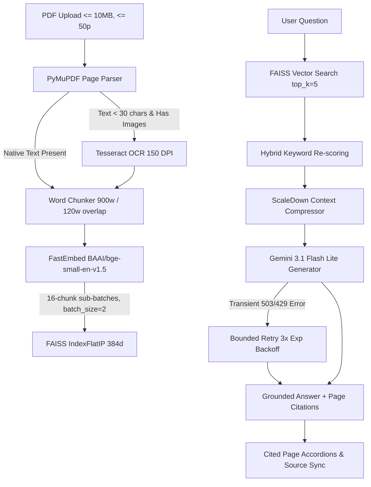

# Product Manual Assistant

[](https://www.python.org/)
[](https://fastapi.tiangolo.com/)
[](https://react.dev/)
[](https://www.typescriptlang.org/)
[](https://vitejs.dev/)
[](https://tailwindcss.com/)
[](https://ai.google.dev/)
[](https://github.com/qdrant/fastembed)
[](https://github.com/facebookresearch/faiss)
[](https://supabase.com/)

**Product Manual Assistant** is a production-ready, multi-document RAG (Retrieval-Augmented Generation) application that transforms complex PDF product user manuals into interactive, conversational workspaces. Users can upload product manuals, ask natural-language questions, and receive grounded answers accompanied by verified page-level source citations.

---

## Overview

### Problem Statement
Product manuals for electronics, appliances, and industrial equipment are dense PDFs (up to 50+ pages). Finding quick solutions for setup or troubleshooting via standard search is inefficient:
- Keyword searches match irrelevant text and miss semantic context.
- Scanned PDF pages lack searchable text unless processed with OCR.
- Un-grounded AI models hallucinate technical specifications.
- Memory-constrained cloud environments (such as Render Free 512 MB RAM) crash under heavy PDF processing or vector matrix allocations.

### Solution
Product Manual Assistant delivers an optimized pipeline:
1. **PyMuPDF Parsing & Selective OCR**: Native page text extraction with fallback to Tesseract OCR at 150 DPI on sparse/scanned pages.
2. **FastEmbed & Incremental FAISS Indexing**: Dense 384-dimensional vector embeddings (`BAAI/bge-small-en-v1.5`) inserted into FAISS (`IndexFlatIP`) in 16-chunk sub-batches to maintain low peak memory.
3. **Hybrid Retrieval & Context Compression**: Dense semantic search combined with keyword re-scoring and ScaleDown context compression to maximize answer accuracy and reduce prompt overhead.
4. **Reliable Gemini Generation**: Google Gemini 3.1 Flash Lite API integration with bounded exponential retry handling for transient 503/429 service spikes.
5. **Responsive Dual-Mode UI**: A modern SPA supporting Supabase Cloud persistence or Guest local mode, fully optimized for desktop down to 320px mobile screens.

---

## Key Features

- **Multi-Document Workspace**: Upload, index, organize, and query multiple PDF product manuals per workspace session.
- **Smart PDF & OCR Engine**: PyMuPDF parses native page text; Tesseract OCR processes image pages at 150 DPI (saving 75% memory over 300 DPI).
- **Memory-Optimized Vector Pipeline**: FastEmbed ONNX inference (`batch_size=2`) and incremental FAISS index loading engineered for 512 MB RAM limits.
- **Hybrid Retrieval & Compression**: Vector similarity (`IndexFlatIP` with L2 normalization) combined with lexical re-ranking and ScaleDown compression.
- **Resilient Gemini API Client**: Grounded answer generation using `gemini-3.1-flash-lite` with bounded retries (up to 3 retries at ~2s, 4s, 8s backoff) for transient API errors.
- **Exact Page Citation Mapping**: Answers include explicit `[Page N]` citations mapped directly to expandable source accordions in the UI.
- **Dual-Mode Authentication & Persistence**:
  - **Cloud Mode**: Supabase Auth (Email/Password, OTP, Google OAuth), PostgreSQL database, and Supabase Storage bucket.
  - **Guest Mode**: Offline-ready local SQLite database (`backend/data/app.db`) and local FAISS index files.
- **Responsive UI/UX**: Custom styling system supporting touch controls (44px+ tap targets), mobile navigation drawer, responsive PDF dropzone, and responsive chat interface across 320px–1280px+ viewports.

---

## How It Works



### Execution Pipeline
1. **Ingestion & Safety Validation**: Validates PDF file size ($\le 10\text{ MB}$), page count ($\le 50\text{ pages}$), and encryption status.
2. **Page Extraction & OCR**: Extracts native text per page. Pages with fewer than 30 characters containing raster images trigger Tesseract OCR.
3. **Word Chunking**: Splits document pages into overlapping text chunks (`900` words per chunk, `120` word overlap), filtering Table of Contents sections.
4. **Incremental Vector Indexing**: Computes 384-dimensional embeddings via FastEmbed (`BAAI/bge-small-en-v1.5`) and inserts them into FAISS (`IndexFlatIP`) in 16-chunk sub-batches with $L_2$ normalization.
5. **Hybrid Retrieval**: Retrieves top candidates ($k=5$), re-scores with lexical keyword density, and compresses context via ScaleDown.
6. **Resilient Answer Generation**: Sends compressed context to Google Gemini. If transient 503/429 errors occur, backoff retries execute before falling back to extractive answers if necessary.
7. **UI Accordion Sync**: Answers render with formatted markdown and expandable source accordions matched to exact cited page numbers.

---

## Tech Stack

| Domain | Technology | Usage |
| :--- | :--- | :--- |
| **Frontend** | React 18.3, TypeScript 5.6, Vite 6 | Interactive Single-Page Application (SPA) UI & state |
| **Styling** | Vanilla CSS Tokens, Tailwind CSS 3.4, Lucide Icons | Responsive design system, dark/light palette, glassmorphism |
| **Backend API** | Python 3.10+, FastAPI 0.115, Uvicorn | Async REST API endpoints, file uploads, state handlers |
| **Embeddings** | FastEmbed (`BAAI/bge-small-en-v1.5`) | 384-dimensional ONNX dense text embeddings |
| **Vector Store** | FAISS (`IndexFlatIP`) | Cosine similarity vector index with $L_2$ normalization |
| **LLM Generation** | Google Gemini API (`google-genai`), `gemini-3.1-flash-lite` | Grounded answer generation & transient error retry engine |
| **PDF & OCR** | PyMuPDF (`fitz`), Tesseract OCR | Native PDF text parsing & 150 DPI scanned page OCR |
| **Database & Auth** | Supabase (PostgreSQL, Storage, JWT Auth) | Persistent user accounts, cloud document storage & RLS |
| **Local Fallback** | SQLite 3, Local File Storage | Offline guest mode storage (`app.db`, local `.faiss` files) |
| **Testing** | Pytest 9.1, Python `unittest` | Automated unit & integration test suite (38 passing tests) |

---

## RAG Pipeline Details

- **Chunking Configuration**: Word-based chunking with `chunk_size = 900` words, `overlap = 120` words, and automatic Table of Contents header filtering.
- **Embedding Model**: FastEmbed `BAAI/bge-small-en-v1.5` (384 dimensions, single-threaded ONNX execution with `threads=1`, `enable_cpu_mem_arena=False`). Cached using `@lru_cache(maxsize=1)`.
- **Incremental Indexing**: Encodes text chunks with `batch_size=2` and populates the FAISS `IndexFlatIP` index in sub-batches of `16` chunks.
- **Retrieval Thresholds**: Top $k=5$ candidates retrieved, minimum retrieval score threshold `0.20`, ScaleDown compression target ratio `0.90`.
- **Source Filtering**: UI sources are filtered against generated answer page citations to maintain exact 1:1 relevance.

---

## PDF Processing and OCR

- **Engine**: PyMuPDF (`fitz`) handles page parsing.
- **Selective OCR Fallback**: Triggered only when extracted page text length is under 30 characters and raster images exist on the page.
- **OCR Resolution**: Configured to 150 DPI to reduce peak RAM usage by 75% compared to 300 DPI.
- **Limits**:
  - Maximum File Size: **10 MB**
  - Maximum Page Count: **50 pages**
  - Password-Protected PDFs: Rejected with explicit validation error messages.

---

## Memory-Aware Indexing & Render Free Optimizations

The application is engineered to operate reliably within resource-constrained environments (such as Render Free's **512 MB RAM limit**):
- **Model Warmup**: Embedding model loaded during FastAPI lifespan startup to avoid peak memory spikes on initial user requests.
- **Thread Pool Controls**: Environment variables set single-thread limits (`OMP_NUM_THREADS=1`, `MKL_NUM_THREADS=1`, `OPENBLAS_NUM_THREADS=1`, `TOKENIZERS_PARALLELISM=false`).
- **Incremental Sub-Batching**: Sub-batching FAISS vector additions prevents massive temporary NumPy array allocations.
- **Explicit Garbage Collection**: Garbage collection (`gc.collect()`) runs after PDF parsing, OCR page cleanup, and index generation.
- **Observed RSS Memory Profile**: FastEmbed initialization baseline ~387 MB RSS. Verified indexing on test documents including 21-page and 27-page product manuals.

---

## Gemini Reliability & Retry Handling

To mitigate intermittent Gemini API 503 (Service Unavailable / High Demand) and 429 (Rate Limit) errors:
- **Bounded Retries**: Maximum **3 retries** after the initial attempt.
- **Exponential Backoff**: Delays of approximately **2s**, **4s**, and **8s** between retry attempts.
- **Non-Retryable Handling**: Client 4xx errors (e.g. invalid API key or 400 Bad Request) fail fast without retrying.
- **Extractive Fallback**: If retries are exhausted or no API key is present, the system returns a cited extractive answer from manual excerpts.

---

## Authentication and Data Architecture

### Dual-Mode Data Architecture
- **Cloud Mode (Supabase)**: Active when Supabase environment variables are provided. User accounts authenticate via Supabase Auth (Email/Password, OTP code verification, or Google OAuth). User documents, chunks, and chat history persist to PostgreSQL with Row-Level Security (RLS). PDF files store in the `manuals` bucket.
- **Guest / Local Mode**: Active during guest sessions or when running standalone. Data persists to a local SQLite database (`backend/data/app.db`), local FAISS files (`backend/data/indexes/`), and local disk storage (`backend/data/manuals/`).

---

## Responsive UI/UX

The frontend Single-Page Application is designed with modern light SaaS aesthetics (Soft Lavender, Slate, Indigo gradients) and tested across all standard viewports:
- **320px–430px (Mobile Phones)**: No horizontal page scroll. Collapsible mobile navigation drawer with 44px+ touch tap targets, responsive upload dropzone, touch-friendly composer, and responsive auth modal.
- **768px (Tablets)**: Flexible drawer navigation, clean header bar, and adaptable chat cards.
- **1024px+ (Laptops & Desktops)**: Sticky sidebar navigation, full multi-document workspace views, and expanded analytics cards.

---

## Project Structure

```text
product-manual-assistant/
├── backend/
│   ├── api/
│   │   ├── auth.py              # Supabase JWT auth, token validation & guest handlers
│   │   └── main.py              # FastAPI router, RAG query endpoints & lifespan startup
│   ├── data/                    # Local storage fallback directory
│   │   ├── app.db               # SQLite local database
│   │   ├── indexes/             # Local FAISS index files (.faiss, .pkl)
│   │   └── manuals/             # Local PDF manual uploads (.pdf)
│   ├── rag/
│   │   ├── chunker.py           # Word-based chunking & TOC filtering
│   │   ├── generator.py         # Gemini API client & bounded retry mechanism
│   │   ├── pdf_loader.py        # PyMuPDF page parsing + 150 DPI Tesseract OCR fallback
│   │   └── retriever.py        # FastEmbed & incremental FAISS vector retriever
│   ├── scaledown/
│   │   └── compressor.py        # Question-aware context compression
│   ├── database.py              # Dual-mode persistence layer (Supabase + SQLite)
│   └── database_schema.sql      # Supabase PostgreSQL schema & RLS policies
├── frontend/
│   ├── src/
│   │   ├── components/          # React UI components (AnswerCard, Sidebar, AuthModal, etc.)
│   │   ├── lib/                 # Supabase client & helper utilities
│   │   ├── App.tsx              # Main application workspace state & router
│   │   ├── main.tsx             # React DOM root entry
│   │   ├── style.css            # Responsive CSS styling & token system
│   │   └── types.ts             # TypeScript interface definitions
│   ├── index.html               # SPA HTML template
│   ├── package.json             # Frontend npm configuration & dependencies
│   ├── tailwind.config.js       # Tailwind CSS configuration
│   └── vite.config.ts           # Vite build & proxy settings
├── tests/
│   ├── test_auth.py             # Unit tests for JWT validation & guest fallback
│   └── test_rag_core.py         # Unit tests for chunker, RAG pipeline & retry logic
├── .env.example                 # Environment variable template
├── .gitignore                   # Git exclusion rules
├── Dockerfile                   # Deployment container manifest
├── README.md                    # Project documentation
└── requirements.txt             # Backend Python dependencies
```

---

## Local Setup & Installation

### Prerequisites
- **Python**: 3.10 or higher
- **Node.js**: v18 or higher & npm
- **Tesseract OCR**: Installed system-wide (`C:\Program Files\Tesseract-OCR` on Windows or `tesseract-ocr` on Linux/macOS) for scanned PDF support.

### 1. Clone Repository & Setup Virtual Environment

```bash
git clone https://github.com/your-username/product-manual-assistant.git
cd product-manual-assistant

# Create Python virtual environment
python -m venv .venv

# Activate virtual environment:
# On Windows (PowerShell):
.venv\Scripts\Activate.ps1
# On Linux/macOS:
source .venv/bin/activate
```

### 2. Install Dependencies

```bash
# Install backend dependencies
pip install -r requirements.txt

# Install frontend dependencies
cd frontend
npm install
cd ..
```

### 3. Configure Environment Variables

Create a `.env` file in the root directory:

```env
# Gemini API Configuration
GEMINI_API_KEY=your_gemini_api_key_here
GEMINI_MODEL=gemini-3.1-flash-lite

# Supabase Frontend Configuration
VITE_SUPABASE_URL=https://your-supabase-project.supabase.co
VITE_SUPABASE_ANON_KEY=your_supabase_anon_key_here

# Supabase Backend Configuration
SUPABASE_URL=https://your-supabase-project.supabase.co
SUPABASE_JWT_SECRET=your_supabase_jwt_secret_here
SUPABASE_SERVICE_ROLE_KEY=your_supabase_service_role_key_here
```

---

## Running the Application

### Running Backend (FastAPI)

```bash
# From workspace root:
.venv\Scripts\python -m uvicorn backend.api.main:app --reload --port 8000
```
*Backend runs at `http://localhost:8000` (Interactive Swagger API docs at `http://localhost:8000/docs`).*

### Running Frontend (Vite)

```bash
cd frontend
npm run dev
```
*Frontend runs at `http://localhost:5173`.*

---

## Verification & Testing

### Backend Unit Test Suite

Run the 38 backend automated unit tests:

```bash
.venv\Scripts\python -m pytest
```
*Result: **38 passed** cleanly.*

### Frontend Production Build Check

Verify TypeScript compilation and Vite production bundling:

```bash
cd frontend
npm run build
```
*Result: **0 errors**, production bundle generated in `frontend/dist/`.*

---

## Deployment & Cloud Considerations

- **Frontend**: Deploy `frontend/dist/` to **Vercel**, **Netlify**, or **Cloudflare Pages**. Set `VITE_SUPABASE_URL` and `VITE_SUPABASE_ANON_KEY` in environment settings.
- **Backend**: Deploy FastAPI application to **Render**, **Railway**, or **Google Cloud Run**. Ensure system packages include `tesseract-ocr` and `libgl1` for PyMuPDF/OCR support.
- **Memory Footprint**: Designed for Render Free (512 MB RAM limit). Incremental batching and PyTorch thread limits ensure stable execution.

---

## Current Limitations

- **File Limits**: Supports PDFs up to 10 MB and 50 pages maximum per upload.
- **Encrypted Files**: Password-protected PDFs must be unlocked prior to upload.
- **System Dependencies**: OCR on scanned image pages requires Tesseract OCR binaries installed on the host OS.

---

## Future Enhancements

- [ ] Table structure extraction for complex technical specification grids.
- [ ] Multi-manual cross-document search across user-defined collection folders.
- [ ] Voice query audio recording & synthesis.

---

## Author

**Dev Verma**  
*Full-Stack & AI Systems Engineer*
